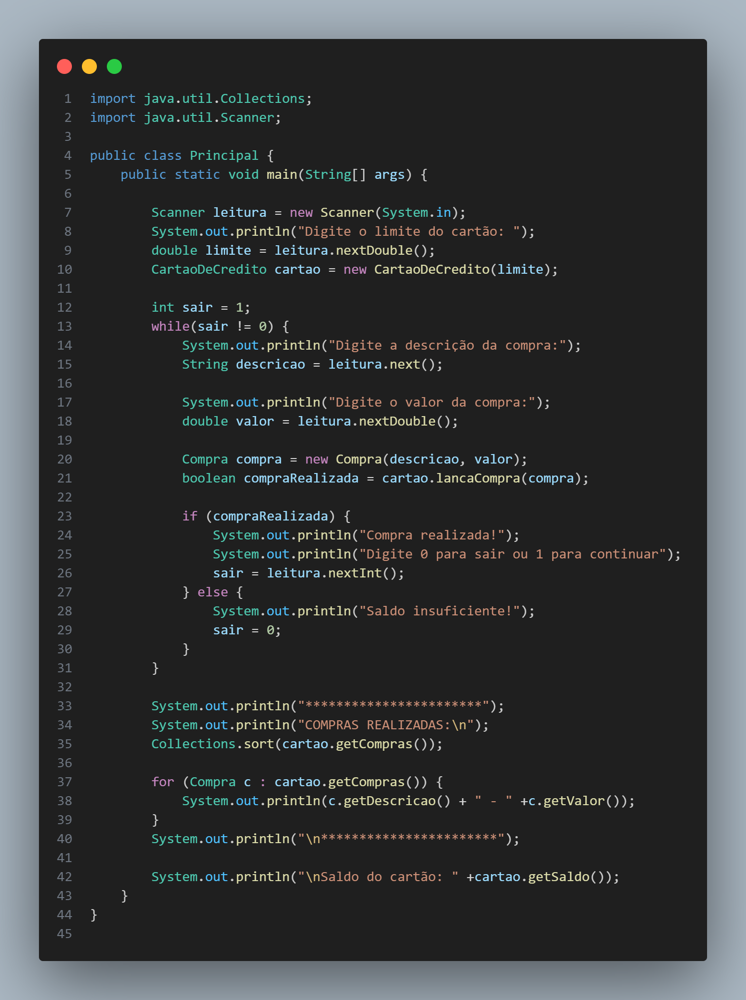

# 💳 Desafio Cartão

Este projeto foi desenvolvido como parte de um desafio de lógica de programação com a linguagem **Java**. O objetivo é simular um sistema de controle de limite de um cartão de crédito, praticando conceitos de orientação a objetos e controle de fluxo.

## 🧩 Funcionalidades

- Definir limite inicial do cartão
- Realizar compras com descrição e valor
- Validar se há saldo suficiente para a compra
- Exibir todas as compras realizadas
- Mostrar saldo restante no cartão

## 📷 Imagem do Código Principal

## 🛠 Tecnologias Utilizadas

 

## 🔍 Estrutura do Projeto

O projeto está dividido em classes principais:

- `Compra`: representa uma compra, com descrição e valor.
- `CartaoDeCredito`: armazena o limite e lista de compras, além de realizar validações.
- `Main`: responsável pela interação com o usuário e execução das funcionalidades.

## 💡 Objetivo

Este projeto tem como objetivo praticar:

- Manipulação de listas
- Validação de dados
- Encapsulamento e orientação a objetos
- Lógica de controle de saldo

## 🔗 Links Úteis

- [Documentação Java](https://docs.oracle.com/en/java/)
- [Visual Studio Code](https://code.visualstudio.com/)
- [Git SCM](https://git-scm.com/)
- [Repositório no GitHub](https://github.com/kalebemax/desafio-cartao)